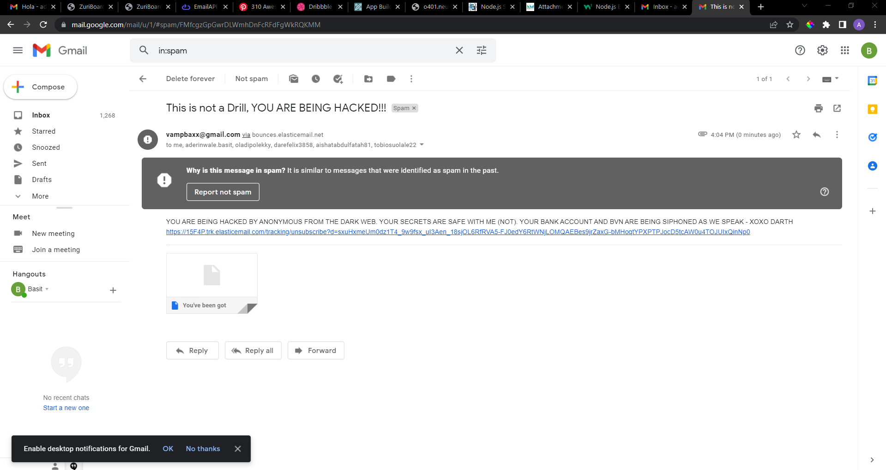

# Zuri-Nodemailer
# Task Title: Email Sender NodeJs

Task Objective: To send automated emails from your NodeJs app. Also to be able to implement solutions majorly by going through the documentation.

Task Description: Create a new NodeJs app or use one you already have to send an automated email to a Gmail account.

You are to use "Nodemailer" (the email sender package in NodeJs). So you will install it within your project and then send a mail to your Google mail account.

You can try bulk messaging (optional)

Push codes to GitHub and briefly describe this feature in your readme file.

Add a screenshot of the sent mail to your readme file.

### Screenshot

